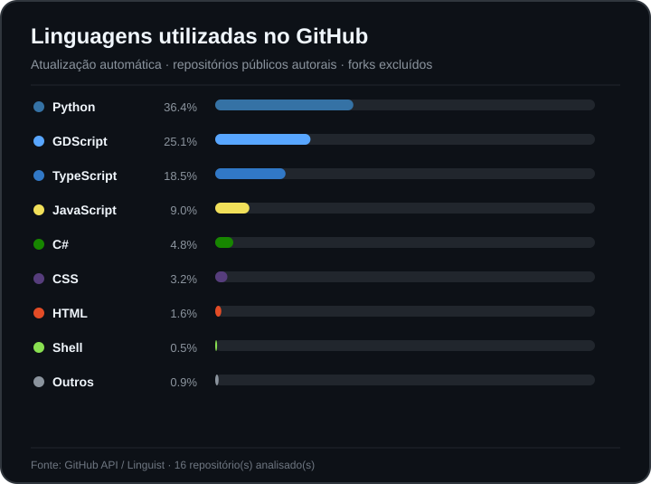

**Idioma / Language:** [ Português](./README.md) | [ **English**](./README.en.md)

# William de Melo Berger

**Python Backend Developer | FastAPI · SQL · Docker | Applied AI & Automation**

I develop software focused on **Python and backend development**, turning real-world problems into APIs, automations, and testable applications. Applied AI and systems integration are my main strengths, but I aim to keep engineering fundamentals visible in the code: modeling, API contracts, persistence, tests, CI, security, and reproducible documentation.

I am looking for opportunities as a **Junior Python/Backend Developer**, including teams working with applied AI, automation, or data-driven products.

[LinkedIn](https://www.linkedin.com/in/william-m-berger/) · [Repositories](https://github.com/berger33?tab=repositories)

---

## Core stack

`Python` · `FastAPI` · `PostgreSQL` · `SQL` · `Pytest` · `Docker` · `Git/GitHub`.

**Additional strengths:** APIs and integrations, local RAG/LLMs, n8n, MQTT/IoT, GitHub Actions, and AI-assisted development with review and testing.

---

## Projects for technical review

### 1. [CHS Recruta](https://github.com/berger33/chs-recruta) — Python backend for a real HR need

CHS Recruta addresses a real HR problem: bringing together candidates, job openings, screening, the recruitment pipeline, reports, and operational history. The current version uses **Python + FastAPI + PostgreSQL**, with modular code, authentication/RBAC, auditing, tests, Docker, and CI in its own repository.

**What to review:** domain modeling, REST API, validation, persistence, authentication/RBAC, tests, product decisions, and infrastructure.

### 2. [LeadFlow Local First](https://github.com/berger33/leadflow-local-first) — Applied AI and integration

Local-first automation with **n8n, Ollama, Gmail, Google Calendar, WhatsApp/WAHA, and PostgreSQL**. Sensitive actions require human approval, and CI starts the actual infrastructure to validate the initial setup flow.

**What to review:** service integration, Docker, operational security, contract tests, smoke tests, and tool behavior.

### 3. [Indoor Grow Automation](https://github.com/berger33/indoor-grow-automation) — Systems and IoT

A local automation platform with **FastAPI, PostgreSQL, MQTT, React, and ESP32**. The project separates validated software from hardware still awaiting commissioning and includes a quality gate for the backend, frontend, firmware, virtual HIL, and security.

**What to review:** systems architecture, backend, messaging, tests, firmware, and explicit handling of physical limitations.

### 4. [Aurora Document RAG](https://github.com/berger33/aurora-document-rag) — Retrieval and document AI

A Python/FastAPI document assistant that answers questions using only the application's PDFs and CSVs. The architecture separates ingestion, embeddings, vector retrieval, generation, citations, and evaluations, with an option for **local generative RAG via Ollama** and a reproducible offline mode for CI.

**What to review:** Python, FastAPI, retrieval, provider interfaces, refusal to answer beyond the knowledge base, sources, and API/behavior tests.

---

## How I work

In my portfolio projects, I aim to make technical evidence easy to verify:

1. the problem and requirements;
2. architectural decisions appropriate to the context;
3. code organized by responsibility;
4. domain, integration, or behavior tests;
5. reproducible CI;
6. a concise README linking to code and detailed documentation in `docs/`;
7. known limitations documented without presenting simulations as production systems.

I use AI tools to accelerate research, implementation, review, and documentation. **I do not treat generated code as evidence on its own:** I aim to keep decisions, tests, PRs, and system limitations auditable, and I study the code I present in my portfolio.

---

## Fundamentals I am strengthening

- API design and contract validation;
- relational modeling, SQL, migrations, and transactions;
- authentication, authorization, and application security;
- unit tests, integration tests, and testability through dependency injection;
- logging, failure handling, and observability;
- Docker, CI, and backend application deployment.

---

## Education

**Oracle Next Education (ONE) — Artificial Intelligence, Agents, and RAG**

I also take courses and develop projects focused on Applied Artificial Intelligence and Software Engineering.

---

## Languages on GitHub

  

The chart is updated automatically by GitHub Actions and is only a secondary indicator; for a technical review, I recommend exploring the four projects above.

---

## Contact

[LinkedIn](https://www.linkedin.com/in/william-m-berger/) · [GitHub](https://github.com/berger33)
