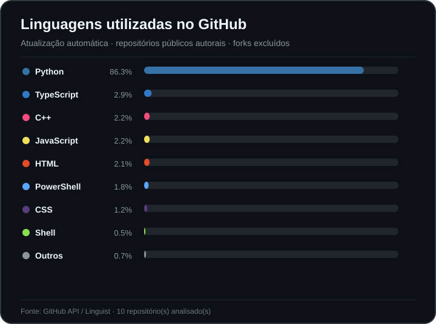
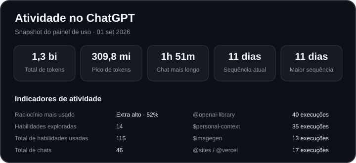

# William de Melo Berger

**Python Backend Developer | FastAPI · PostgreSQL · Docker | Applied AI & Automation**

Desenvolvo software com foco em **Python e backend**, transformando problemas reais em APIs, automações e aplicações testáveis. IA aplicada e integração entre sistemas são meus principais diferenciais, mas procuro manter os fundamentos de engenharia visíveis no código: modelagem, contratos de API, persistência, testes, CI, segurança e documentação reproduzível.

Busco oportunidades como **Desenvolvedor Python/Backend Júnior**, incluindo times que trabalhem com IA aplicada, automação ou produtos orientados a dados.

[LinkedIn](https://www.linkedin.com/in/william-m-berger/) · [Repositórios](https://github.com/berger33?tab=repositories)

---

## Stack principal

`Python` · `FastAPI` · `PostgreSQL` · `SQL` · `Pytest` · `Docker` · `Git/GitHub`.

**Diferenciais:** APIs e integrações, RAG/LLMs locais, n8n, MQTT/IoT, GitHub Actions e desenvolvimento assistido por IA com revisão e testes.

---

## Projetos para avaliação técnica

### 1. [CHS Recruta](https://github.com/berger33/chs-recruta) — Backend Python para uma necessidade real de RH

O CHS Recruta resolve um problema real de RH: centralizar candidatos, vagas, triagem, funil, relatórios e histórico operacional. A versão atual usa **Python + FastAPI + PostgreSQL**, com código modular, autenticação/RBAC, auditoria, testes, Docker e CI em repositório próprio.

**O que avaliar:** modelagem de domínio, API REST, validação, persistência, autenticação/RBAC, testes, decisões de produto e infraestrutura.

### 2. [LeadFlow Local First](https://github.com/berger33/leadflow-local-first) — IA aplicada e integração

Automação local-first com **n8n, Ollama, Gmail, Google Calendar, WhatsApp/WAHA e PostgreSQL**. Ações sensíveis passam por aprovação humana e o CI sobe a infraestrutura real para validar o fluxo de primeira instalação.

**O que avaliar:** integração de serviços, Docker, segurança operacional, testes de contrato, smoke tests e comportamento de tools.

### 3. [Indoor Grow Automation](https://github.com/berger33/indoor-grow-automation) — sistemas e IoT

Plataforma local de automação com **FastAPI, PostgreSQL, MQTT, React e ESP32**. O projeto separa software validado de hardware ainda pendente de comissionamento e possui quality gate para backend, frontend, firmware, HIL virtual e segurança.

**O que avaliar:** arquitetura de sistemas, backend, mensageria, testes, firmware e tratamento explícito de limites físicos.

### 4. [Aurora Document RAG](https://github.com/berger33/aurora-document-rag) — retrieval e IA documental

Assistente documental em Python/FastAPI para responder somente com base em PDFs e CSVs da aplicação. A arquitetura separa ingestão, embeddings, retrieval vetorial, geração, citações e evals, com opção de **RAG generativo local via Ollama** e modo offline reproduzível para CI.

**O que avaliar:** Python, FastAPI, retrieval, interfaces de providers, recusa fora da base, fontes e testes de API/comportamento.

---

## Como trabalho

Nos projetos de portfólio procuro deixar a evidência técnica fácil de verificar:

1. problema e requisitos;
2. decisões de arquitetura proporcionais ao contexto;
3. código organizado por responsabilidade;
4. testes de domínio, integração ou comportamento;
5. CI reproduzível;
6. README curto apontando para código e documentação detalhada em `docs/`;
7. limitações conhecidas descritas sem apresentar simulação como produção.

Uso ferramentas de IA para acelerar pesquisa, implementação, revisão e documentação. **Não trato código gerado como evidência por si só:** procuro manter decisões, testes, PRs e limites do sistema auditáveis e estudo o código que apresento como portfólio.

---

## Fundamentos que estou consolidando

- desenho de APIs e validação de contratos;
- modelagem relacional, SQL, migrations e transações;
- autenticação, autorização e segurança de aplicações;
- unit tests, integration tests e testabilidade por injeção de dependência;
- logs, tratamento de falhas e observabilidade;
- Docker, CI e deploy de aplicações backend.

---

## Formação

**Oracle Next Education (ONE) — Inteligência Artificial, Agentes e RAG**

Também curso e desenvolvo projetos voltados a Inteligência Artificial aplicada e Engenharia de Software.

---

## Linguagens no GitHub

  

O painel é atualizado automaticamente por GitHub Actions e é apenas um indicador secundário; para avaliação técnica, recomendo abrir os quatro projetos acima.

---

## Uso de IA no desenvolvimento

  

  

> **Atualização:** estes dois painéis são snapshots do uso exibido pelo ChatGPT/Codex em 01/09/2026. Diferentemente do painel de linguagens do GitHub, eles ainda não podem ser sincronizados integralmente por GitHub Actions usando uma API pública de uso pessoal do ChatGPT/Codex. Assim que houver uma fonte oficial programática para esses dados, a estrutura do perfil já está pronta para trocar os snapshots por atualização automática.

---

## Contato

[LinkedIn](https://www.linkedin.com/in/william-m-berger/) · [GitHub](https://github.com/berger33)
