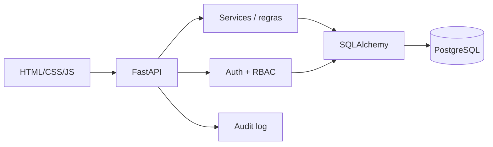

# CHS Recruta — Python Backend

**Sistema de recrutamento e seleção com Python, FastAPI, SQLAlchemy, PostgreSQL, RBAC, auditoria, testes e Docker.**

> Esta pasta é a versão de staging da reconstrução do CHS Recruta. O destino planejado é um repositório próprio `berger33/chs-recruta`; a integração disponível nesta sessão não possui operação administrativa para criar esse repositório.

## Por que este projeto existe

O CHS Recruta nasceu de uma necessidade real de uma profissional de RH. A primeira versão priorizou portabilidade e funcionava inteiramente no navegador. Esta versão preserva o domínio validado, mas migra regras e dados para um backend Python para demonstrar fundamentos que importam em uma vaga de backend: **modelagem relacional, contratos HTTP, autenticação, autorização, persistência, validação, testes e infraestrutura**.

## Evidência técnica

| Área | Onde verificar |
|---|---|
| modelos relacionais | [`app/models.py`](app/models.py) |
| configuração de banco | [`app/database.py`](app/database.py) |
| schemas Pydantic | [`app/schemas.py`](app/schemas.py) |
| regras de negócio | [`app/services.py`](app/services.py) |
| senha, sessão e RBAC | [`app/security.py`](app/security.py) |
| candidatos | [`app/routers/candidates.py`](app/routers/candidates.py) |
| vagas | [`app/routers/vacancies.py`](app/routers/vacancies.py) |
| dashboard/relatórios/auditoria | [`app/routers/operations.py`](app/routers/operations.py) |
| usuários admin | [`app/routers/users.py`](app/routers/users.py) |
| frontend | [`static/`](static/) |
| testes | [`tests/test_app.py`](tests/test_app.py) |
| melhorias planejadas | [`docs/MELHORIAS_E_ROADMAP.md`](docs/MELHORIAS_E_ROADMAP.md) |

## Funcionalidades implementadas

- candidatos com busca e status de funil;
- normalização de profissões para reduzir fragmentação de indicadores;
- detecção de possível duplicidade por nome + telefone/registro;
- vagas, posições e responsáveis;
- matching de candidato com vaga aberta por profissão normalizada;
- dashboard com candidatos, novos, vagas, posições, contratações, conversão e funil;
- referências financeiras;
- exportação CSV UTF-8;
- auditoria de operações com usuário responsável;
- autenticação server-side;
- senha com PBKDF2-HMAC-SHA256;
- sessão bearer com somente o hash do token persistido;
- perfis `admin` e `recruiter`;
- exclusão de candidato e administração de usuários restritas ao admin;
- frontend responsivo separado da camada de domínio.

## Arquitetura



A aplicação usa SQLite por padrão para desenvolvimento/testes rápidos e PostgreSQL no Docker Compose. O código da aplicação não depende de uma implementação específica de interface.

## Executar localmente

```bash
python -m venv .venv
# Windows: .venv\Scripts\activate
# Linux/macOS: source .venv/bin/activate
pip install -r requirements.txt
python -m app.seed
uvicorn app.main:app --reload
```

Acesse:

- aplicação: `http://127.0.0.1:8000`
- OpenAPI: `http://127.0.0.1:8000/docs`
- health check: `http://127.0.0.1:8000/health`

Credencial **somente para demo local** após `python -m app.seed`:

`demo` / `demo12345`

## Docker + PostgreSQL

```bash
docker compose up --build -d
docker compose exec app python -m app.seed
```

## Contratos principais

| Método | Endpoint | Regra |
|---|---|---|
| `POST` | `/api/auth/login` | cria sessão |
| `GET` | `/api/auth/me` | usuário atual |
| `GET/POST` | `/api/candidates` | candidatos |
| `PUT/DELETE` | `/api/candidates/{id}` | delete somente admin |
| `GET` | `/api/candidates/{id}/matches` | vagas compatíveis |
| `GET/POST` | `/api/vacancies` | vagas |
| `GET` | `/api/dashboard` | KPIs/funil |
| `GET` | `/api/audit` | trilha de auditoria |
| `GET/POST` | `/api/financial` | referências financeiras |
| `GET` | `/api/reports/candidates.csv` | relatório CSV |
| `GET/POST` | `/api/users` | somente admin |

## Testes

```bash
pytest -q
```

A suíte cobre fronteira de autenticação, login, normalização, duplicidade, dashboard, criação de vaga, matching, relatório CSV e RBAC de administração de usuários.

## O que mudou em relação à versão portátil

A versão original foi importante para validar fluxo e UX. Nesta versão:

- `localStorage` deixa de ser banco operacional;
- autenticação deixa de ser apenas client-side;
- regras de negócio ficam no backend;
- dados tornam-se relacionais;
- auditoria é persistida no servidor;
- a interface consome contratos HTTP;
- a aplicação passa a ser apropriada para uma evolução multiusuário.

## Próxima evolução

O arquivo [`docs/MELHORIAS_E_ROADMAP.md`](docs/MELHORIAS_E_ROADMAP.md) contém melhorias priorizadas de backend, frontend e funcionalidades específicas de RH. Entre as prioridades estão Alembic, paginação, soft delete, testes PostgreSQL em CI, pipeline configurável, scorecards de entrevista, SLA, analytics de recrutamento e controles LGPD.

## Uso de IA no desenvolvimento

Ferramentas de IA foram usadas como aceleradores de implementação e revisão. A proposta deste repositório é deixar o resultado auditável: modelos, regras, rotas, segurança e testes estão separados e navegáveis. Em entrevista, a tecnologia que apresento como competência é a que consigo explicar e defender tecnicamente.
