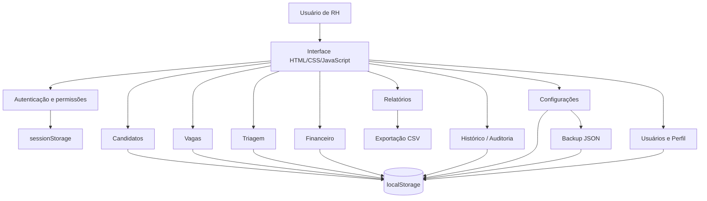

# CHS Recruta Portátil — Case de produto e engenharia

> **Projeto autoral de fim de semana criado para resolver uma necessidade real de recrutamento.**
>
> A versão operacional analisada é a **1.4 (09/08/2026)**. Este case documenta arquitetura, funcionalidades e decisões de produto sem publicar dados pessoais existentes na base original.

## Contexto

O CHS Recruta nasceu para ajudar uma profissional de RH a organizar, em uma única ferramenta, atividades que normalmente ficariam espalhadas entre planilhas, anotações e contatos: cadastro de profissionais, vagas, triagem, acompanhamento do funil, registros financeiros, relatórios e histórico de alterações.

O requisito mais importante era **portabilidade**. A aplicação precisava funcionar sem instalação complexa, sem servidor e sem depender de uma infraestrutura de TI. Por isso a solução foi construída como uma aplicação web local e autocontida, distribuída em um pacote que pode ser aberto diretamente no navegador.

Esse projeto demonstra principalmente **capacidade de transformar uma necessidade informal de usuário em produto funcional**, priorizando simplicidade operacional, experiência de uso e autonomia de quem utiliza o sistema.

---

## Arquitetura



### Decisão local-first

O sistema não necessita backend, banco de dados externo ou conexão permanente com a internet. A base fica armazenada no próprio navegador por meio de `localStorage`, enquanto a sessão utiliza `sessionStorage`.

Isso foi uma decisão de produto, não apenas uma simplificação técnica:

- reduz barreiras de instalação;
- permite execução em computadores comuns;
- elimina custo de servidor;
- mantém a operação disponível mesmo sem internet;
- dá ao usuário controle direto sobre backup e transferência da base.

Como consequência consciente, cada computador possui uma base independente e não há sincronização automática entre máquinas. Para esse cenário de uso, a solução priorizou **portabilidade e autonomia** em vez de uma arquitetura multiusuário em nuvem.

---

## Funcionalidades implementadas

### 1. Dashboard operacional

A página inicial consolida os principais indicadores da operação:

- total de candidatos;
- candidatos ainda não trabalhados;
- vagas abertas;
- número de posições abertas;
- contratações realizadas;
- taxa de conversão;
- funil visual por etapa;
- data do último backup;
- atividades recentes;
- atalhos para inclusão, triagem e backup.

Os indicadores são calculados diretamente a partir da base, sem necessidade de atualização manual de planilhas auxiliares.

### 2. Banco de talentos

O módulo de candidatos inclui:

- inclusão, edição e exclusão controlada;
- nome, profissão, cidade e registro profissional;
- WhatsApp e e-mail;
- origem do candidato;
- link da fonte;
- recrutador responsável;
- status no processo;
- vaga vinculada;
- anotações;
- data e hora de criação;
- data e hora da última alteração.

A listagem permite pesquisa e filtros por status e profissão.

#### Detecção de possíveis duplicidades

Ao salvar um candidato, o sistema procura registros semelhantes utilizando nome combinado com telefone ou registro profissional. Em caso de possível duplicidade, o usuário recebe um aviso e decide conscientemente se deseja continuar.

### 3. Normalização de profissões

Foi criada uma camada de normalização para evitar que variações de gênero ou grafia fragmentem os indicadores.

Exemplos:

- `Fonoaudióloga` e `Fonoaudiólogo` → **Fonoaudiólogo**;
- `Enfermeira` e `Enfermeiro` → **Enfermeiro**;
- `Psicóloga` e `Psicólogo` → **Psicólogo**.

A normalização é aplicada em candidatos, vagas, filtros, indicadores e relatórios.

### 4. Busca inteligente no cabeçalho

A aplicação possui uma busca global de candidatos disponível no topo do sistema.

A pesquisa não depende apenas de igualdade exata. O algoritmo local:

1. remove acentos e caracteres especiais;
2. normaliza caixa e espaços;
3. prioriza correspondência exata;
4. depois nomes que começam com a consulta;
5. depois ocorrências parciais;
6. por fim compara tokens da pesquisa com partes do nome.

O resultado permite abrir diretamente o cadastro encontrado.

### 5. Gestão de vagas

O módulo de vagas permite:

- código automático/sugerido;
- título da oportunidade;
- profissão;
- cidade;
- quantidade de posições;
- status: aberta, pausada, fechada ou cancelada;
- responsável;
- edição e exclusão;
- número de candidatos vinculados;
- indicador visual de cobertura da vaga.

As vagas são exibidas em cards, com barra de progresso comparando candidatos vinculados e quantidade de posições.

### 6. Triagem de candidatos

A triagem foi desenhada como uma estação de trabalho para o RH:

- fila lateral de candidatos;
- resumo do candidato selecionado;
- dados de contato e registro;
- origem;
- vaga atual;
- alteração do status;
- anotações da triagem;
- vínculo com vaga;
- histórico individual;
- sugestão de vagas abertas compatíveis com a profissão.

O matching de vagas ocorre localmente comparando a profissão normalizada do candidato com as vagas abertas.

### 7. Funil de recrutamento

A versão analisada trabalha com etapas como:

- Novo;
- Em Contato;
- Contatado;
- Sem resposta;
- Respondeu;
- Entrevista marcada;
- Entrevistado;
- Contratado;
- Banco de Talentos;
- Não interessado.

Esses estados alimentam automaticamente dashboard, triagem e relatório de funil.

### 8. Financeiro

Há um módulo simples para registrar referências financeiras por serviço:

- serviço;
- valor atual;
- valor máximo;
- diferença disponível;
- inclusão;
- edição;
- exclusão.

Caso o valor máximo fique abaixo do atual, o sistema pede confirmação explícita antes de salvar.

### 9. Central de relatórios

A aplicação gera arquivos CSV para:

- banco completo de candidatos;
- vagas e cobertura;
- funil de contratação;
- tabela financeira.

Os CSVs utilizam BOM UTF-8 e separador `;`, facilitando abertura no Excel em ambientes configurados para português do Brasil.

Também existe uma folha de estilo específica para impressão, removendo navegação e controles desnecessários no papel/PDF.

### 10. Histórico e auditoria

Alterações relevantes são registradas com:

- ação;
- área/entidade;
- nome do registro envolvido;
- observação;
- usuário responsável;
- data;
- hora até o minuto.

A tela de histórico possui filtros por:

- texto;
- data;
- horário.

São auditadas operações de candidatos, vagas, triagem, financeiro, configurações, usuários, perfil, backup/importação e rotinas internas de migração/normalização.

### 11. Backup e restauração

Toda a base pode ser exportada para JSON.

O backup inclui:

- candidatos;
- vagas;
- usuários;
- fotos de perfil;
- registros financeiros;
- histórico;
- configurações.

A importação valida a estrutura do arquivo antes de substituir a base e exige confirmação do usuário. A operação de importação fica restrita ao administrador.

### 12. Usuários e permissões

Existem dois níveis principais de acesso:

**Administrador**

- gerencia usuários;
- pode importar/substituir toda a base;
- pode excluir candidatos;
- possui acesso completo aos módulos.

**Usuário**

- cadastra e edita candidatos;
- trabalha com vagas e triagens;
- utiliza relatórios;
- registra informações financeiras;
- não administra acessos;
- não exclui candidatos.

O menu adapta-se à permissão: a área de usuários não é exibida para contas comuns.

### 13. Autenticação local e proteção contra tentativas repetidas

As senhas são armazenadas como hash SHA-256 com um prefixo interno, e não em texto puro.

O login também possui uma proteção básica contra tentativas repetidas: após cinco falhas, novas tentativas ficam temporariamente bloqueadas por dois minutos.

> Como a aplicação é inteiramente local e client-side, esse mecanismo foi desenvolvido como proteção operacional compatível com o escopo do produto — não como substituto para autenticação server-side em aplicações expostas à internet.

### 14. Perfil e foto do usuário

O usuário pode alterar:

- nome de exibição;
- e-mail;
- senha;
- foto de perfil.

Imagens JPG, PNG e WebP são aceitas até 8 MB. Antes de serem salvas, são redimensionadas para no máximo 512 px e convertidas para JPEG com compressão, reduzindo o consumo da base local.

---

## Interface e experiência de uso

Um ponto importante do projeto foi não entregar apenas um formulário funcional. A aplicação possui uma identidade visual de produto interno.

### Modo dia e modo noite

O seletor fica fixo no canto superior direito e funciona inclusive na tela de login.

Características:

- tema claro e escuro completos;
- detecção inicial da preferência do sistema operacional;
- escolha persistida localmente;
- componentes, formulários, tabelas, cards, modais e resultados de busca adaptados ao tema.

### Personalização por cor

Além do modo dia/noite, o usuário pode escolher entre cinco cores de destaque:

- rosa;
- ciano;
- roxo;
- verde musgo;
- laranja.

A preferência é salva no navegador e reaplicada automaticamente nas próximas sessões.

A implementação usa CSS custom properties (`--accent` e `--accent2`), permitindo que botões, navegação, indicadores, gráficos, campos e estados de interface acompanhem a paleta selecionada.

### Layout

A interface combina:

- topbar fixa/sticky;
- navegação horizontal;
- pesquisa global no cabeçalho;
- cards de KPI;
- tabelas operacionais;
- painéis laterais;
- cards de vagas;
- barras de progresso;
- funil visual;
- modais de edição;
- mensagens toast;
- tooltips contextuais.

### Responsividade

Existem breakpoints específicos para telas menores.

Em dispositivos estreitos:

- o dashboard passa para uma coluna;
- a triagem reorganiza painéis;
- cards e KPIs reduzem o número de colunas;
- a busca ocupa uma linha própria;
- nome do usuário e elementos secundários podem ser ocultados;
- o seletor de tema é compactado.

### Acessibilidade e pequenos detalhes de UX

A implementação também inclui:

- `aria-label` em controles importantes;
- `role="alert"` no erro de login;
- `role="status"` nas mensagens de sistema;
- foco visível para navegação por teclado;
- tecla `Escape` para fechar modais;
- labels em formulários;
- confirmação antes de operações destrutivas;
- mensagens de contexto e tooltips com atraso para evitar ruído visual.

---

## Portabilidade

O pacote original contém:

```text
Abrir_CHS_Recruta.cmd
CHS-Recruta-Portable.html
LEIA-ME.html
VERSAO.txt
```

O usuário extrai o ZIP e abre o sistema pelo `.cmd` ou diretamente pelo HTML.

Não é necessário:

- instalar banco de dados;
- instalar servidor;
- configurar Node.js/Python;
- criar conta em serviço externo;
- manter conexão com internet para uso cotidiano.

---

## Privacidade do case público

A versão original foi construída para um uso real e contém informações de contatos profissionais utilizadas pela pessoa que recebeu a ferramenta.

**Esses dados não são publicados neste portfólio.**

A decisão de documentar o produto sem expor a base operacional demonstra uma preocupação que considero parte da engenharia: um bom portfólio deve provar capacidade técnica sem transformar dados de terceiros em material de demonstração.

---

## O que este projeto demonstra

Mais do que a tecnologia utilizada, o CHS Recruta demonstra minha capacidade de:

- conversar com uma necessidade real e convertê-la em requisitos;
- escolher uma arquitetura proporcional ao problema;
- entregar uma solução utilizável rapidamente;
- pensar em fluxo de trabalho, não apenas em telas isoladas;
- implementar CRUD, busca, filtros, permissões e auditoria;
- tratar persistência e migração de dados locais;
- criar exportação, backup e restauração;
- construir UX responsiva com tema e personalização;
- considerar privacidade, segurança operacional e recuperação de dados;
- evoluir uma ferramenta em versões sem apagar a base existente.

## Tecnologias e conceitos

`HTML5` · `CSS3` · `JavaScript` · `localStorage` · `sessionStorage` · `Web APIs` · `Canvas API` · `FileReader` · `Blob` · `Intl` · `JSON` · `CSV` · `responsive design` · `role-based access` · `client-side persistence` · `local-first software`

---

## Escopo e evolução possível

Para o cenário original, a arquitetura portátil atendia diretamente ao requisito de simplicidade. Em uma evolução para operação multiusuário, eu migraria progressivamente para:

1. API backend;
2. banco relacional;
3. autenticação server-side;
4. criptografia e políticas de sessão adequadas a produção web;
5. sincronização entre usuários;
6. controle de acesso mais granular;
7. testes automatizados de interface e regras de negócio;
8. deploy com observabilidade e backups de servidor.

Essa evolução preservaria os fluxos de produto que já foram validados na versão portátil.
